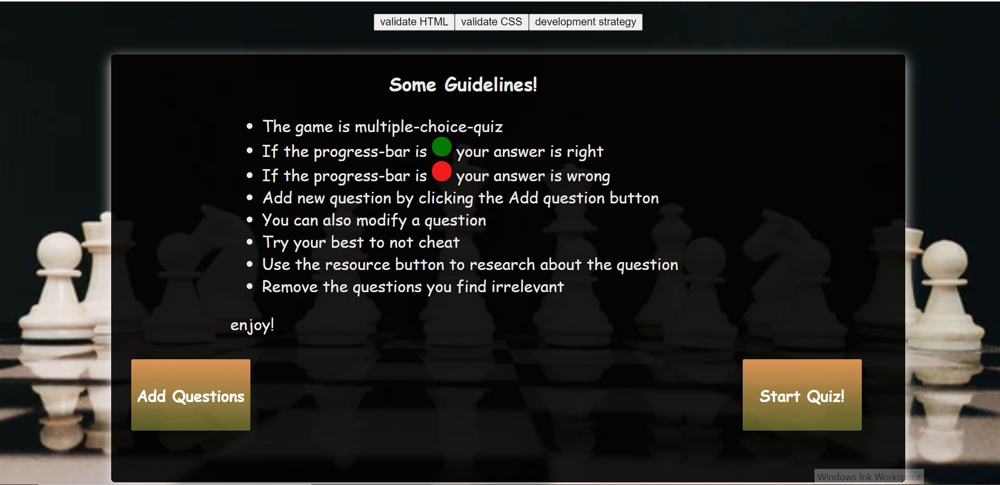

[![Contributors][contributors-shield]][contributors-url]
[![Issues][issues-shield]][issues-url]
[![MIT License][license-shield]][license-url]

  <h3 align="center">"Quiz-Project" Project</h3>

  

    One project Four Juniors.
     
    <a href="https://github.com/fmkarakus/Quiz-Project"><strong>Explore the docs »</strong></a>
     
     
    <a href="https://fmkarakus.github.io/Quiz-Project/">View Demo</a>
    ·
    <a href="https://github.com/fmkarakus/Quiz-Project/issues">Report Bug</a>
    ·
    <a href="https://github.com/fmkarakus/Quiz-Project/issues">Request Feature</a>
  

<!-- TABLE OF CONTENTS -->

## Table of Contents

- [Table of Contents](#table-of-contents)
- [About The Project](#about-the-project)
- [Built With](#built-with)
- [Debuggers](#debuggers)
- [Contributing](#contributing)
- [License](#license)
- [Contact](#contact)
- [Acknowledgements](#acknowledgements)

<!-- ABOUT THE PROJECT -->

## About The Project

The live demo is right [here](https://fmkarakus.github.io/Quiz-Project/), it looks something like this:

This project aims to use work flow while practicing basic JavaScript concepts. For the purpose of this project, the 4 junior developers were partnered together to work on the project.

The objective of this project is to build a simple html,CSS and JavaScript quiz page. In this project we aimed to improve our understanding of

- State
- The separation of concerns
- DOM and interface
- Event delegation
- Event listeners
- Event handlers
- Dynamically setting classes

### Built With

- [Visual studio code](https://code.visualstudio.com/)
- [Gitkraken](https://www.gitkraken.com)
- [GitHub](https://github.com)
- [JavaScript](https://www.javascript.com/)

## Debuggers

- Chrome developer tool
- JS tutor
- Visual Studio Code debugger

<!-- CONTRIBUTING -->

## Contributing

Contributions are what make the open source community such an amazing place to be learn, inspire, and create. Any contributions you make are **greatly appreciated**.

1. Fork the Project
2. Create your Feature Branch (`git checkout -b new-branch`)
3. Commit your Changes (`git commit -m 'Add some AmazingFeature'`)
4. Push to the Branch (`git push origin new-branch`)
5. Open a Pull Request

<!-- LICENSE -->

## License

Distributed under the MIT License. See `LICENSE` for more information.

<!-- CONTACT -->

## Contact

- [Fatih](https://github.com/fmkarakus)
- [Gelila](https://github.com/gelilaa)
- [Yauh](https://github.com/yauheniya-askolkava)
- [Abel](https://github.com/abelRoland)

Project Link: [Quiz-project](https://fmkarakus.github.io/Quiz-Project/)

<!-- ACKNOWLEDGEMENTS -->

## Acknowledgements

- [HYF](https://hackyourfuture.be/)

- [BEST readme template](https://github.com/othneildrew/Best-README-Template/blob/master/README.md)

<!-- MARKDOWN LINKS & IMAGES -->
<!-- https://www.markdownguide.org/basic-syntax/#reference-style-links -->

[contributors-shield]: https://img.shields.io/github/contributors/fmkarakus/Quiz-Project.svg?style=flat-square
[contributors-url]: https://github.com/fmkarakus/Quiz-Project/graphs/contributors
[forks-shield]: https://img.shields.io/github/forks/fmkarakus/Quiz-Project.svg?style=flat-square
[forks-url]: https://github.com/fmkarakus/Quiz-Project/network/members
[issues-shield]: https://img.shields.io/github/issues/fmkarakus/Quiz-Project.svg?style=flat-square
[issues-url]: https://github.com/fmkarakus/Quiz-Project/issues
[license-shield]: https://img.shields.io/github/license/fmkarakus/Quiz-Project.svg?style=flat-square
[license-url]: https://github.com/fmkarakus/Quiz-Project/blob/master/LICENSE